## Prerequisites:
- Please make sure you have assigned the following roles.


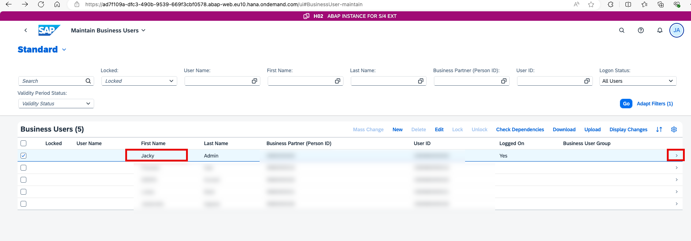


## 1.  Create a service instance of SAP Document Management, Integration Option. 

For more information see - - [Initial Setup for Document Management Service. Integration Option](https://help.sap.com/viewer/f6e70dd4bffa4b65965b43feed4c9429/Cloud/en-US/bc0f1ec7d5374b968e0b0de6db470c94.html) on SAP Help Portal.

This will give you the service instance and service key in the SAP SAP BTP sub-account.

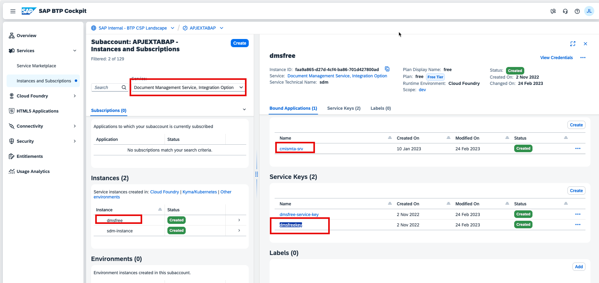
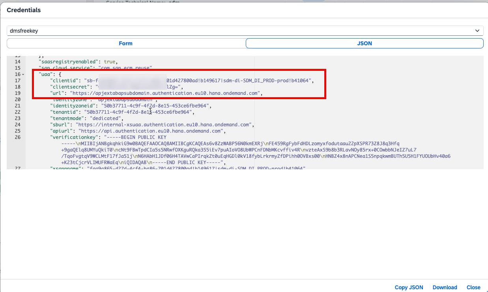
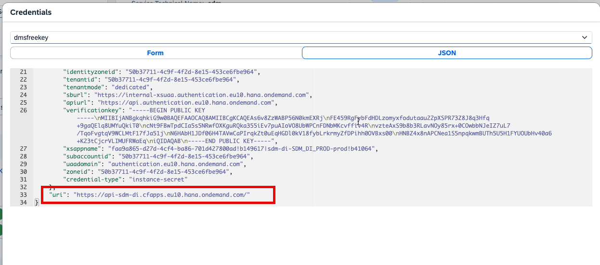


## 2. Onboard a repository. 

For more information, see [SAP API Business Hub - Administrative Operations](https://api.sap.com/api/AdminAPI/tryout).

Afterwards, log in with your username and password.


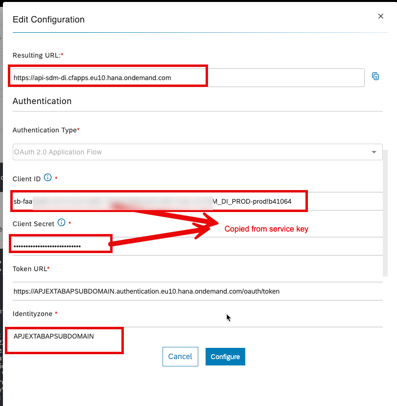
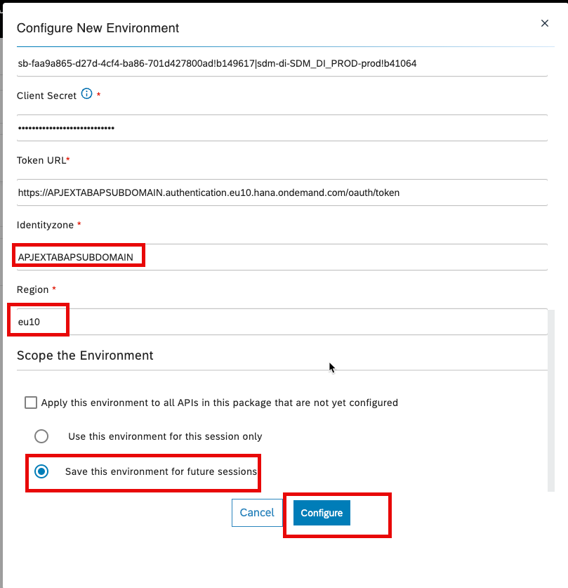
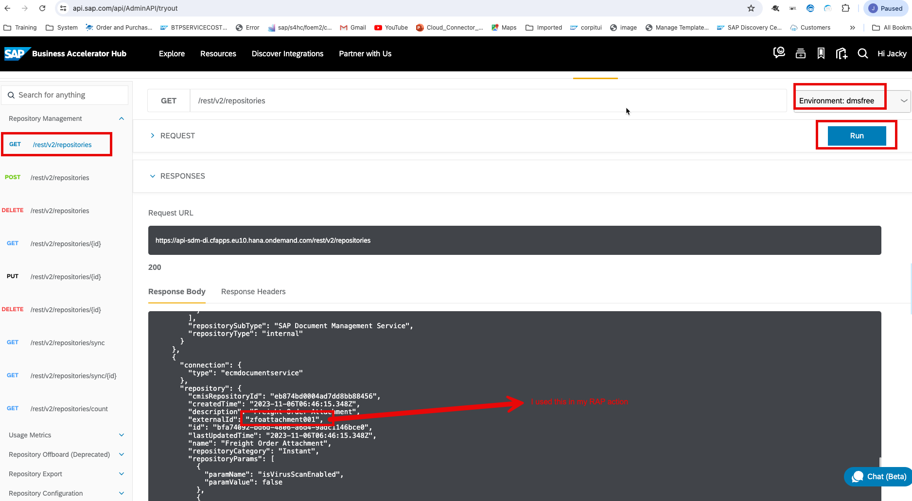
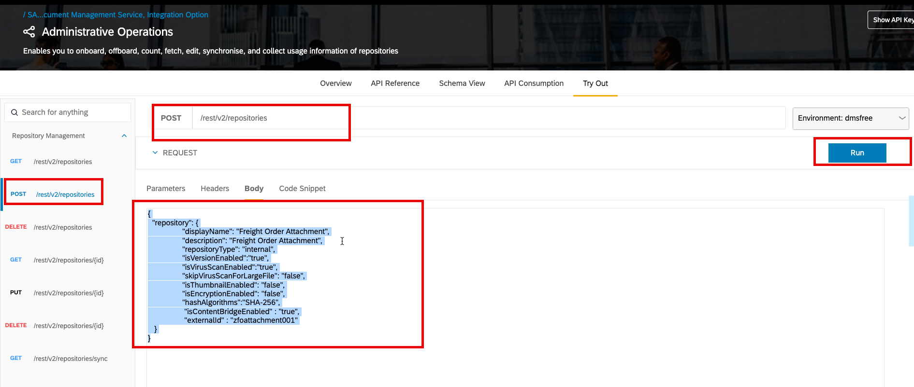

Change the body to the following text. Keep the external ID as zfoattachment001. It will be used later in the RAP program.

```

{
  "repository": {
		"displayName": "Freight Order Attachment",
		"description": "Freight Order Attachment",
		"repositoryType": "internal",
		"isVersionEnabled":"true",
		"isVirusScanEnabled":"true",
		"skipVirusScanForLargeFile": "false",
		"isThumbnailEnabled": "false",
		"isEncryptionEnabled": "false",
		"hashAlgorithms":"SHA-256",
                 "isContentBridgeEnabled" : "true",
	         "externalId" : "zfoattachment001"
   }
}

```
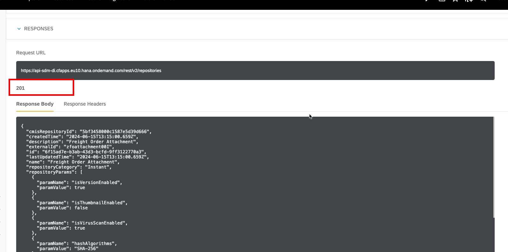


## 3. Connect to an SAP BTP, ABAP environment instance and create a Communication Arrangement for SAP_COM_0668.

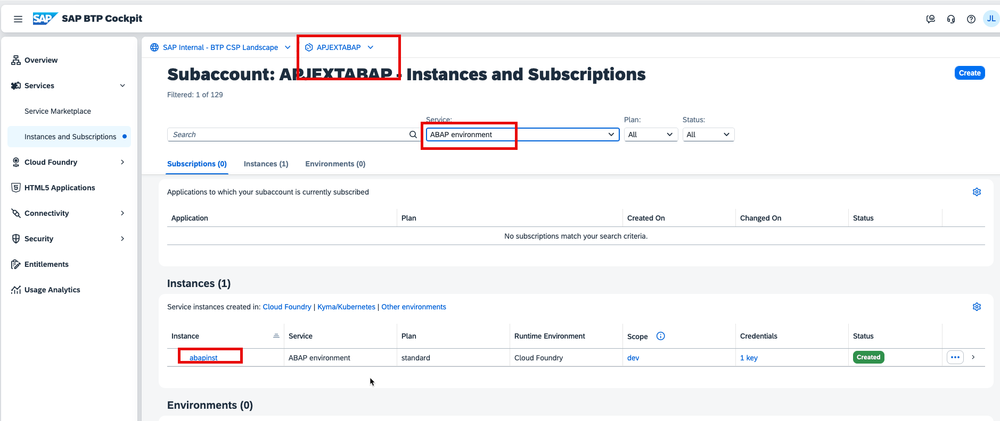
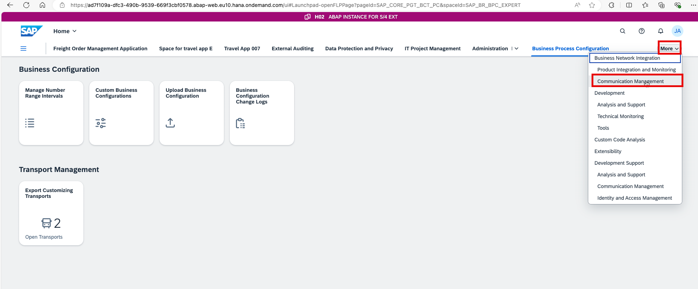


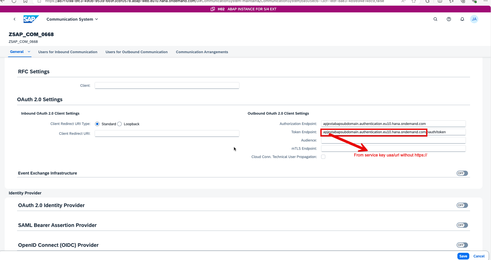
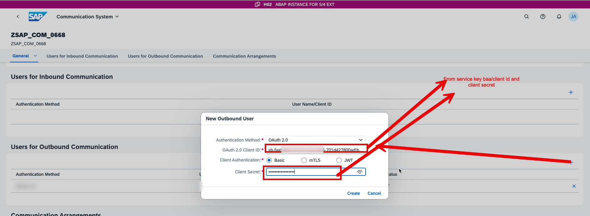


