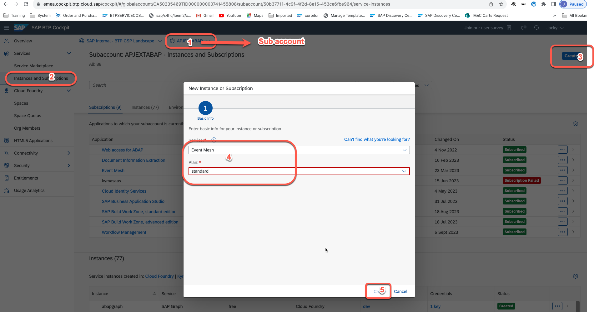
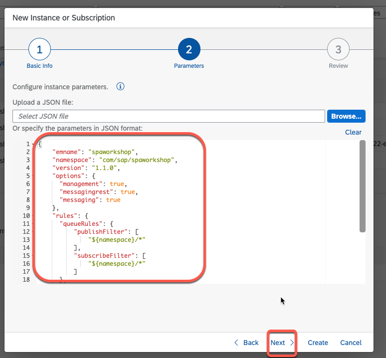
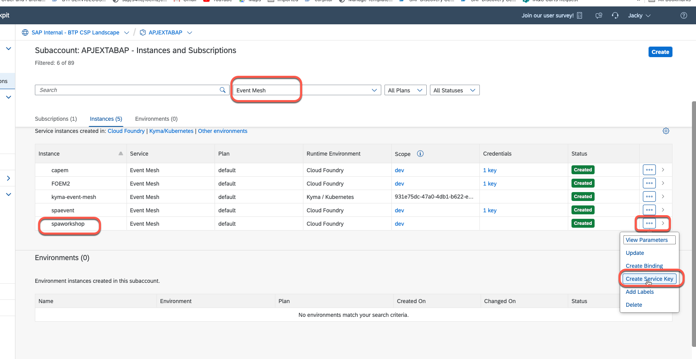
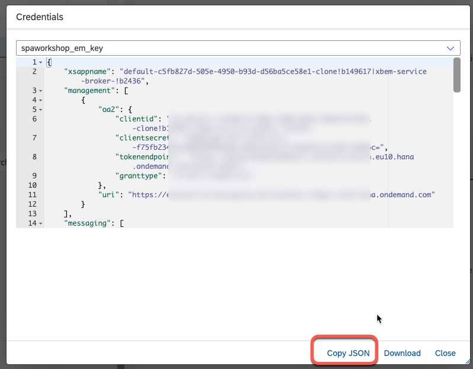

## Segtion 1: Configure Event Mesh in BTP subaccount.

### Step 1:Create Event Mesh Subscription
Since I have created event mesh subscription, so I can not create again. But if you have not created event mesh subscription, you can create a new event mesh subscription.

### Step 2: Assign Event Mesh role collections to your user account.


### Step 3: Create Event Mesh instance.


you can use json as the following file:

```json
{
    "emname": "spaworkshop",
    "namespace": "com/sap/spaworkshop",
    "version": "1.1.0",
    "options": {
      "management": true,
      "messagingrest": true,
      "messaging": true
    },
    "rules": {
      "queueRules": {
          "publishFilter": [
              "${namespace}/*"
          ],
          "subscribeFilter": [
              "${namespace}/*"
          ]
      },
      "topicRules": {
          "publishFilter": [
              "${namespace}/*"
          ],
          "subscribeFilter": [
              "${namespace}/*"
          ]
      }
    }
  }
  ```
  


### Step 4: Create Event Mesh instance service key




We will use the copied service key information to create communication arrangements in S/4 Hana Cloud in following Segment.

